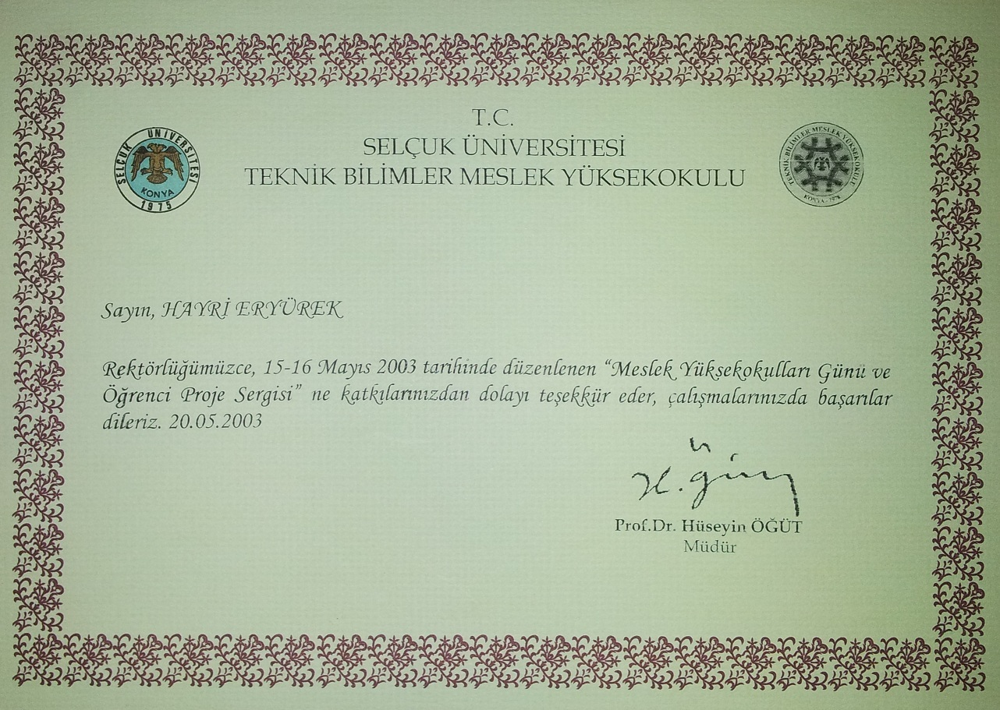
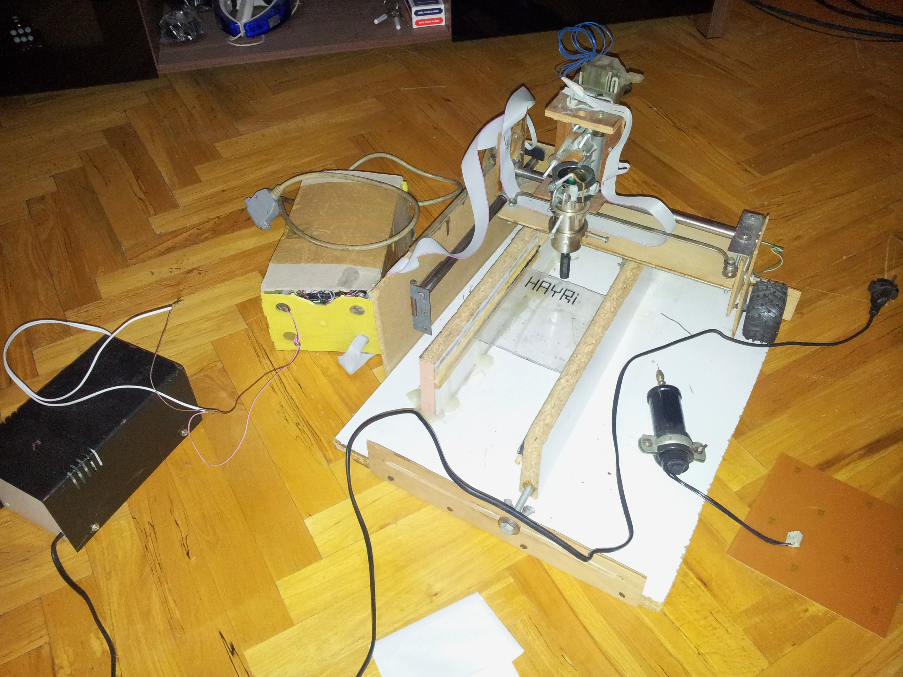
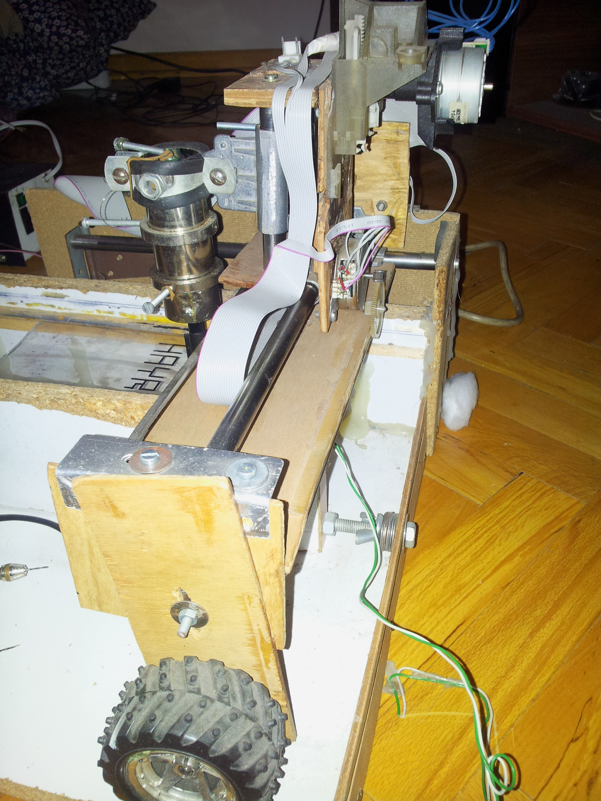
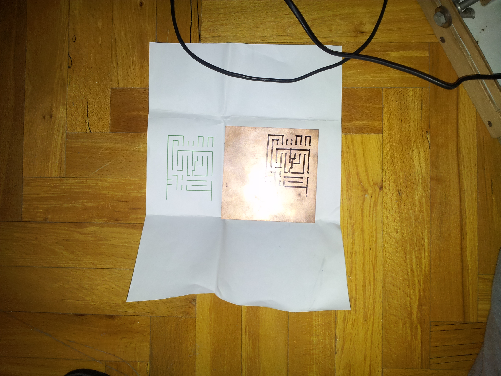
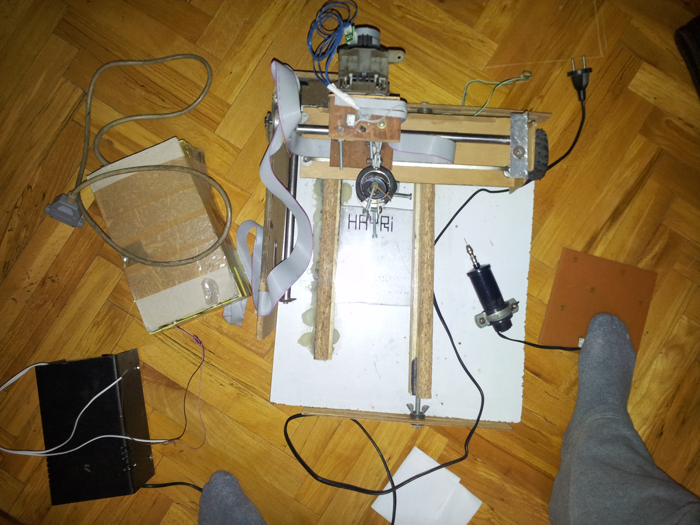
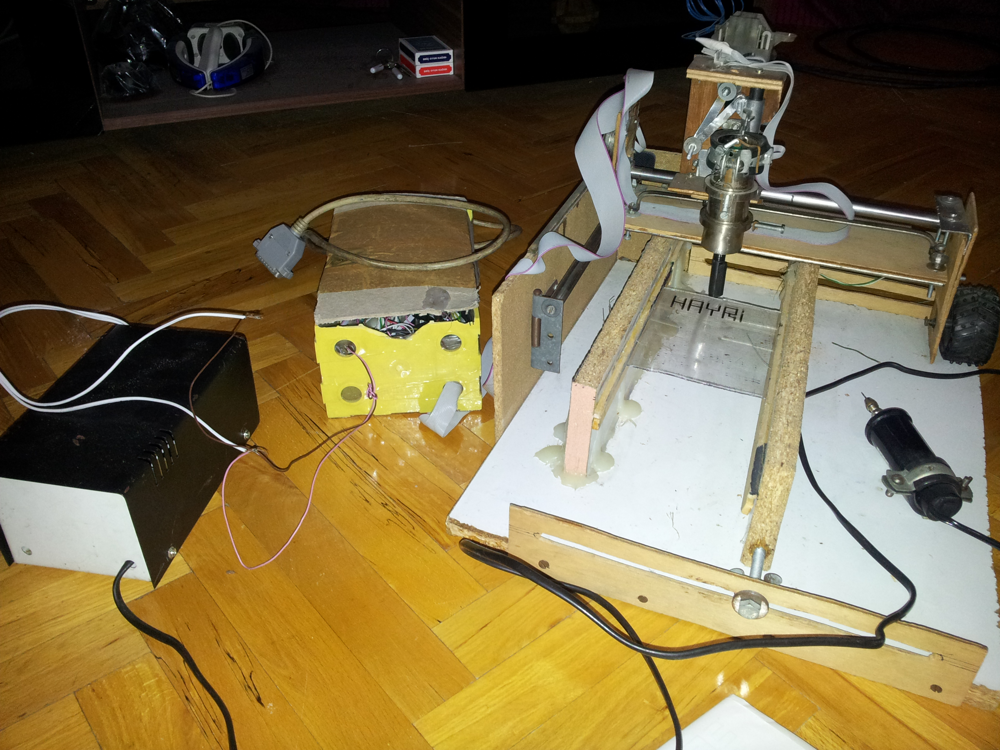
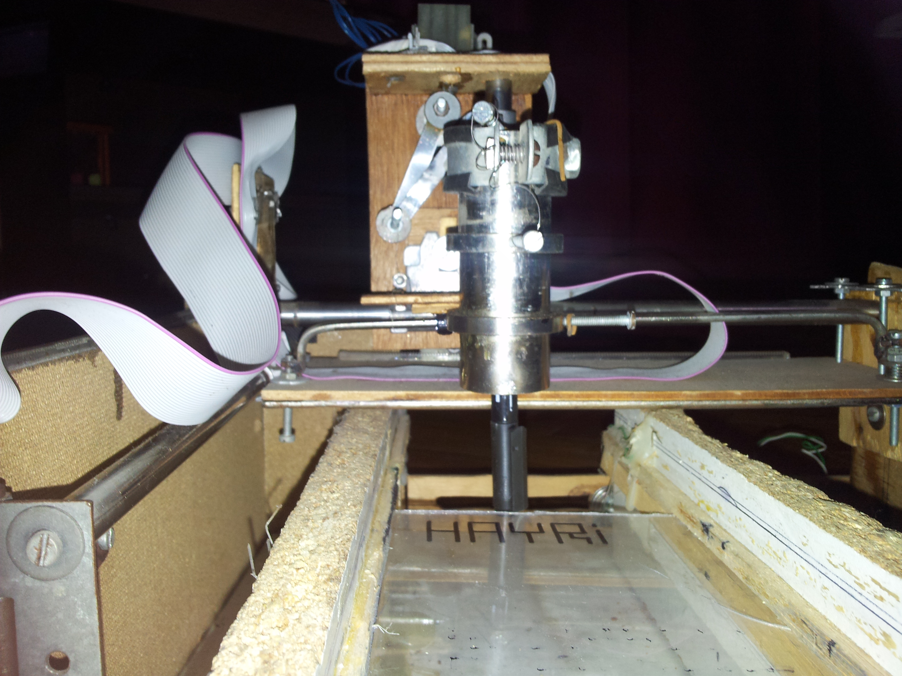
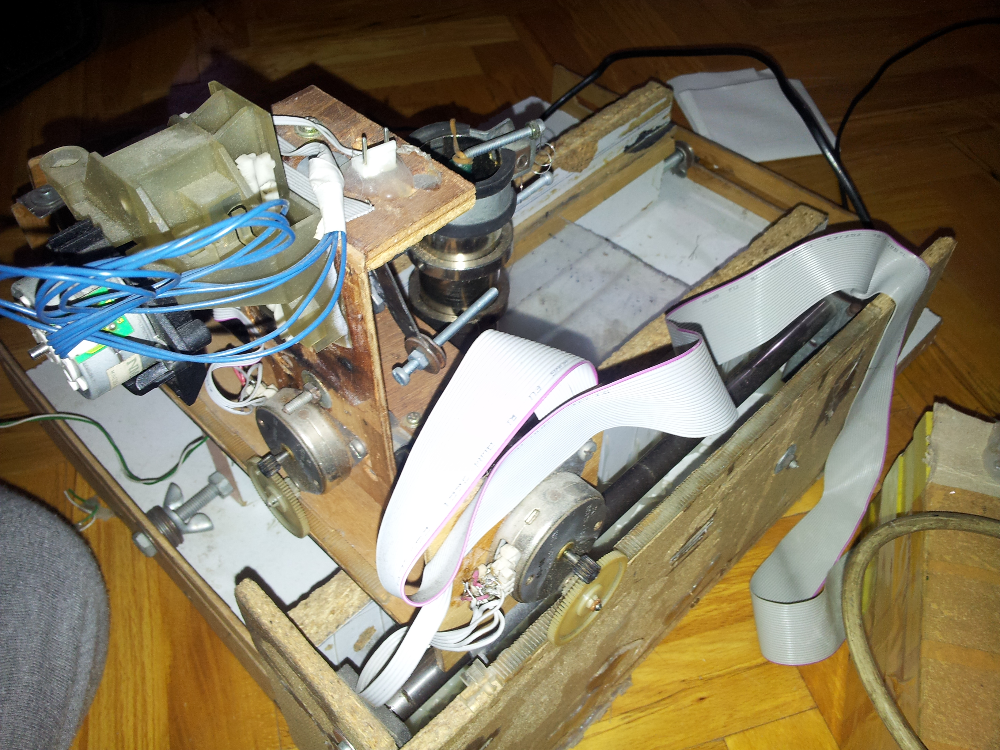
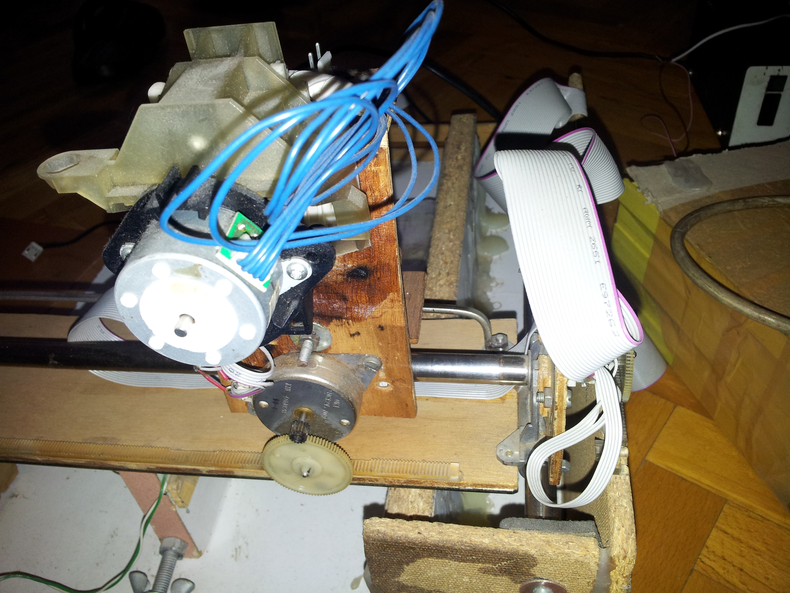

# Elektronik Plaket devre Çizici ve Delici - Yıl 2003
 
## Merhaba

Bu proje günümüzdeki 3 Boyutlu yazıcıların mekaniğini 2003 yılında elektronik devreleri seri bir şekilde üretebilmek için yaptığım küçük cnc.

  

  

  

  

  

  

  

  

  

